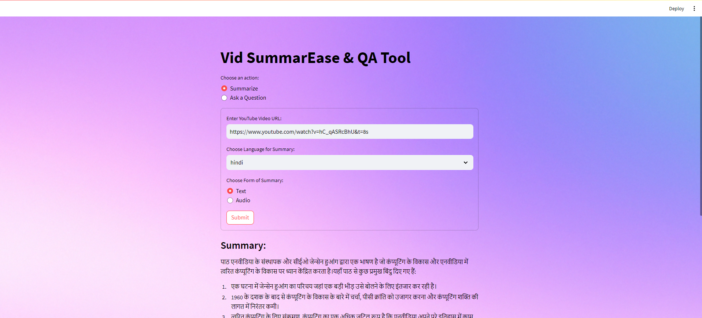
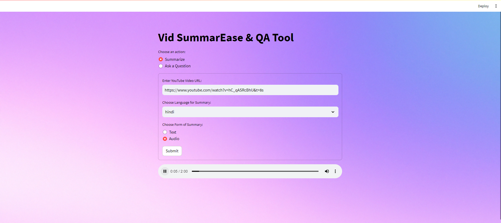
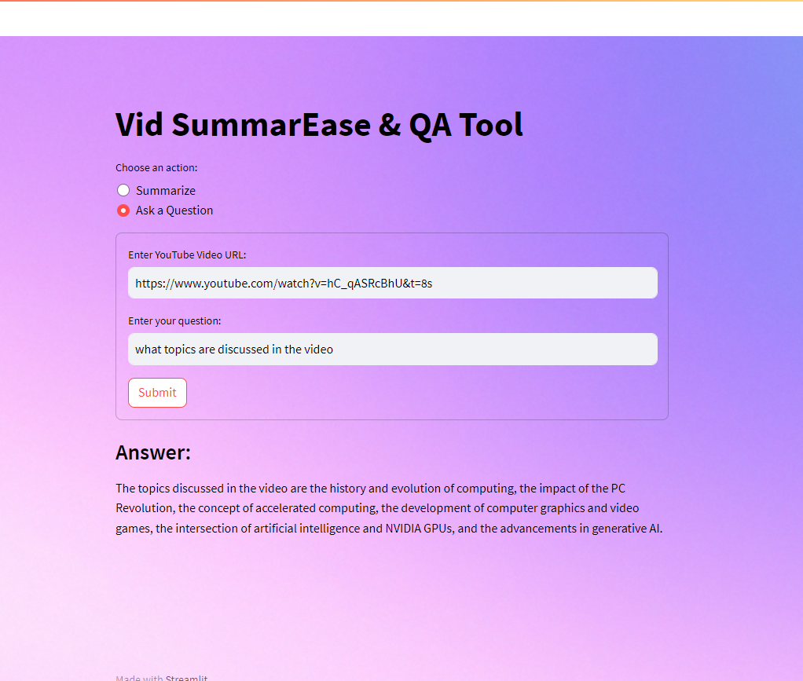

# Vid SummarEase & QA Tool

This project is a Streamlit application that extracts transcripts from YouTube videos, summarizes them, translates the summaries, and answers questions based on the video's content. It also offers an option to convert the summary into an audio format.







## Features

- **YouTube Video Transcript Extraction:** Retrieves transcripts from YouTube videos.
- **Text Summarization:** Summarizes the extracted transcript using OpenAI's GPT-3.5-turbo model.
- **Language Translation:** Translates the summary into various languages using Google Translate.
- **Audio Conversion:** Converts the text summary into audio using Google Text-to-Speech.
- **Question Answering:** Provides precise answers to user questions based on the video transcript.

## Setup

### Prerequisites

Ensure you have the following installed:

- Python 3.10+
- Streamlit
- youtube-transcript-api
- openai
- gtts
- googletrans

### Installation

1. Clone the repository:
    ```sh
    git clone https://github.com/yourusername/vid-summarease-qa-tool.git
    cd vid-summarease-qa-tool
    ```

2. Install the required packages:
    ```sh
    pip install -r requirements.txt
    ```

3. Set your OpenAI API key in the script:
    ```python
    openai.api_key = 'your OpenAI API key'
    ```

4. Run the Streamlit app:
    ```sh
    streamlit run app.py
    ```

## Usage

1. **Set Background Image (Optional):**
    - The background image can be customized by setting the path to the desired image in the `set_bg_hack` function.

2. **User Interface:**
    - Choose an action: "Summarize" or "Ask a Question".
    - Enter the YouTube video URL.
    - For summarization:
      - Choose the language for the summary.
      - Choose the form of summary: Text or Audio.
    - For asking a question:
      - Enter your question related to the video content.
    - Click "Submit" to perform the chosen action.

3. **Results:**
    - For summarization: The summary will be displayed as text or played as audio, based on your choice.
    - For questions: The answer will be displayed.

## Functions

- `set_bg_hack(main_bg)`: Sets a background image for the Streamlit app.
- `get_transcript(video_id)`: Retrieves the transcript for the given YouTube video ID.
- `preprocess_text(text, max_length=5000)`: Preprocesses text to fit within token limits.
- `summarize_text(text)`: Summarizes the given text using OpenAI's GPT-3.5-turbo model.
- `answer_question(text, question)`: Provides an answer to the given question based on the text.
- `translate_text(text, dest_language)`: Translates the text to the specified language.
- `generate_audio_summary(summary, lang='en')`: Converts the text summary into an audio file.

## Example

To summarize a YouTube video and get the summary in French as an audio file:

1. Choose "Summarize".
2. Enter the YouTube video URL.
3. Choose "French" as the language.
4. Choose "Audio" as the form of summary.
5. Click "Submit".